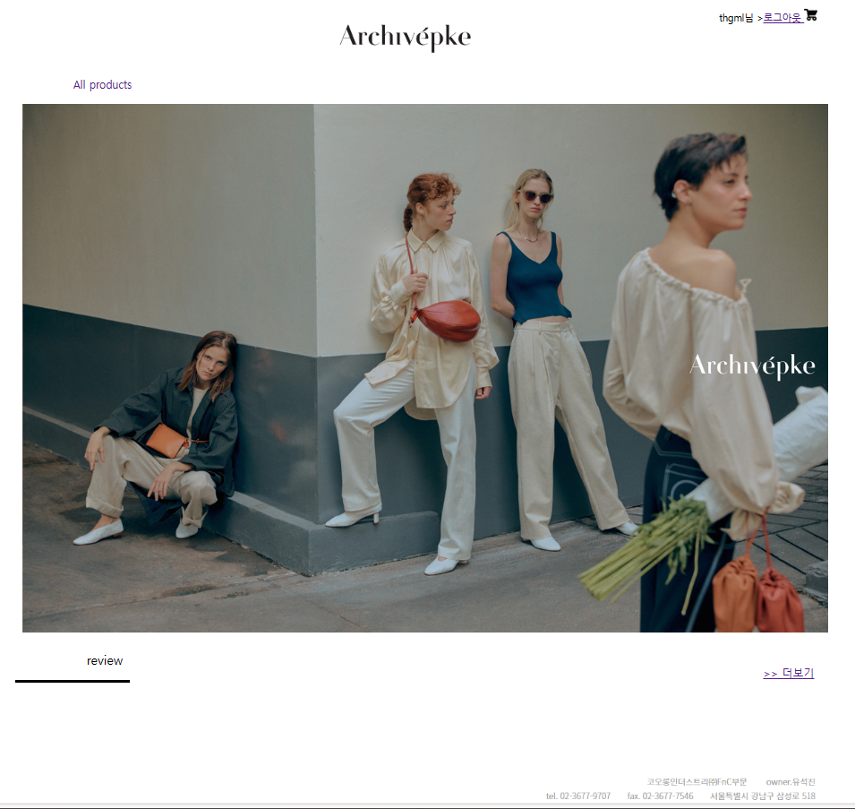

# archivepke
2023 웹서비스 프로그래밍 term-project

  
  
  

### 프로젝트 진행 일정
- 제안서 발표: 11월 8일
- 중간 보고서 제출: 11월 22일
- 결과 시스템 발표: 12월 6일
### 주요기능
- 로그인/로그아웃 기능
- 게시판
- 자바스크립트, CSS, EL식, 표준액션, 커스텀액션, 태그 클래스 사용
